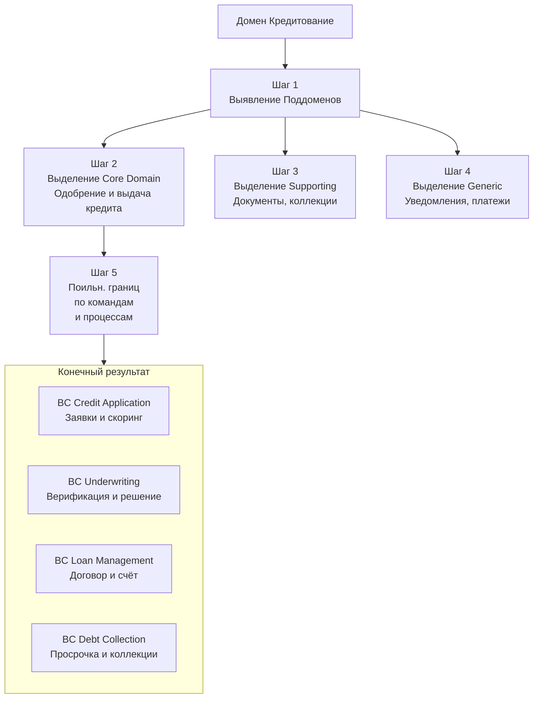

**Domain-Driven Design (DDD)** — это не технология, а **подход к разработке сложного программного обеспечения**, основанный на глубоком погружении в предметную область (домен) и отражении её структуры в коде.

Главная цель DDD — создать гибкую, понятную и легко изменяемую систему, которая может эволюционировать вместе с бизнесом. Для этого разработчики и бизнес-эксперты вместе строят общую модель на основе **единого языка (Ubiquitous Language)** — терминов, понятных всем участникам.

### 🧱 Ключевые строительные блоки DDD
Вот как основные концепции DDD отражаются в коде банковской системы:

| Концепция DDD | Простая суть | Пример в кредитовании |
| :--- | :--- | :--- |
| **Домен (Domain)** | Предметная область, которую решает система. | Вся банковская деятельность, связанная с выдачей, обслуживанием и погашением кредитов. |
| **Поддомен (Subdomain)** | Логическая часть домена. Бывает **Core** (ключевая), **Supporting** (поддерживающая), **Generic** (общая). | **Core:** Расчет кредитного скоринга, одобрение заявки.   **Supporting:** Верификация документов, работа с коллекторами.   **Generic:** Отправка уведомлений (SMS, email). |
| **Ограниченный контекст (Bounded Context, BC)** | **Самая важная концепция.** Четко очерченная граница, внутри которой модель (классы, термины) имеет конкретное, единое значение. | **Контекст «Кредитная Заявка»:** Здесь `Заявка` — это заполненная анкета и документы, ожидающие проверки. В другом контексте значение может быть другим. |
| **Единый язык (Ubiquitous Language)** | Строгий набор терминов, единый для разработчиков, аналитиков и бизнес-экспертов **внутри одного BC**. | В BC «Кредитная Заявка» говорят: «Заявка перешла в статус `Underwriting`, `Скоринг-модель` выдала балл». Это исключает двусмысленности. |
| **Сущность (Entity)** | Объект, уникальность которого определяется **идентификатором** (ID), а не атрибутами. | `Клиент` (уникален по ID), `КредитныйДоговор` (уникален по номеру договора). |
| **Объект-Значение (Value Object)** | Объект, не имеющий идентификатора. Определяется своими атрибутами. Неизменяем. | `ДенежнаяСумма` (сумма + валюта), `ПаспортныеДанные` (серия, номер, кем выдан). |
| **Агрегат (Aggregate)** | **Ключевой тактический паттерн.** Группа связанных объектов (Сущностей и Объектов-Значений), которые рассматриваются как единое целое. Имеет **корень (Aggregate Root)** — единственную точку входа для изменений. | Агрегат `КредитнаяЗаявка`. Его корень — Сущность `Заявка`. Внутри могут быть: `Анкета` (Объект-Значение), `СписокДокументов` (коллекция). Изменять заявку можно **только** через ее корень. |
| **Сервис домена (Domain Service)** | Операция или правило, которое логически не принадлежит ни одному Агрегату/Сущности. Часто координирует несколько Агрегатов. | **`СкорингСервис`:** Принимает `Заявку` и `ИсториюКлиента`, возвращает балл. Это чистая бизнес-логика, не принадлежащая ни заявке, ни истории. |

### 🗺️ Шаги по разбиению домена «Кредитование» на Bounded Context
Процесс декомпозиции на примере кредитования выглядит так:

**1. Картирование событий и процессов**
   *   **Event Storming**: Соберите команду (разработчики, бизнес-аналитики, кредитные эксперты) и на большом холсте распишите ключевые **события** в процессе кредитования: `КлиентПодалЗаявку`, `СкорингЗавершен`, `ЗаявкаОдобрена`, `КредитВыдан`, `ПлатежПросрочен`.
   *   **Выявление процессов**: Сгруппируйте события в бизнес-процессы (подача заявки, проверка, выдача, обслуживание, работа с просрочкой).

**2. Выявление поддоменов и определение Core Domain**
   *   **Core Domain**: Что является вашим ключевым конкурентным преимуществом? Для одного банка — это **мгновенный автоматический скоринг**, для другого — **гибкие программы реструктуризации**. Это станет центром архитектуры и получит максимум ресурсов.
   *   **Supporting Subdomains**: Процессы, важные для бизнеса, но не уникальные: верификация документов, расчет графика платежей.
   *   **Generic Subdomains**: Стандартные задачи, которые можно купить или выделить в отдельную библиотеку: отправка уведомлений, генерация PDF-договоров.

**3. Определение Bounded Context по командам и процессам**
   *   Сопоставьте поддомены и процессы с организационной структурой. **BC должен примерно соответствовать зоне ответственности одной команды** (Conway's Law).
   *   **Ключевой вопрос**: «Где меняется значение термина?» Термин `Заявка` в процессе проверки документов (досье) и в процессе скоринга (набор данных для модели) — это разные понятия. Это сильный сигнал к разделению на разные BC.

### 🏦 Результат разбиения домена «Кредитование»
| Bounded Context (BC) | Зона ответственности (Единый язык внутри) | Ключевые агрегаты | Тип поддомена |
| :--- | :--- | :--- | :--- |
| **Credit Application** | Прием заявок, первичная валидация, скоринг. | `LoanApplication` (Заявка), `ScoringModel` | **Core** |
| **Underwriting** | Верификация документов, проверка КЛ, принятие финального решения. | `VerificationCase` (Досье), `Underwriter` | **Supporting** |
| **Loan Management** | Выдача кредита, формирование договора и графика, учет платежей, расчет остатка. | `LoanAccount` (Кредитный счет), `PaymentSchedule` | **Core/Supporting** |
| **Debt Collection** | Управление просроченной задолженностью: оповещения, реструктуризация, работа с коллекторами. | `DelinquentLoan` (Просрочка), `RestructuringPlan` | **Supporting** |

### 🔗 Связи между контекстами: как они общаются
После выделения BC важно определить, как они будут взаимодействовать:
*   **События (Event-Driven)**: Контекст `Credit Application` публикует событие `ЗаявкаОдобрена`. Контексты `Loan Management` и `Notification` подписываются на него и запускают свои процессы.
*   **REST API / RPC**: Используется для синхронных запросов, например, `Underwriting` запрашивает данные о клиенте из общего сервиса `Customer Profile`.
*   **Общие Kernel / Shared Kernel**: Общая библиотека с ключевыми моделями (например, `ClientId`, `Money`), используемая несколькими командами. **Применяйте с крайней осторожностью**, так как это создает сильную связь.

### 🎯 Практические шаги для начала
1.  **Проведите сессию Event Storming** по своему продукту.
2.  **Нарисуйте контекстную карту (Context Map)** — схему, как ваши текущие или планируемые сервисы (BC) связаны между собой.
3.  **Определите один Core BC** и попробуете реализовать его, строго соблюдая правила агрегатов и единый язык.
4.  **Не стремитесь к идеалу с первого раза**. DDD — это итеративный процесс, границы будут уточняться по мере развития продукта.
